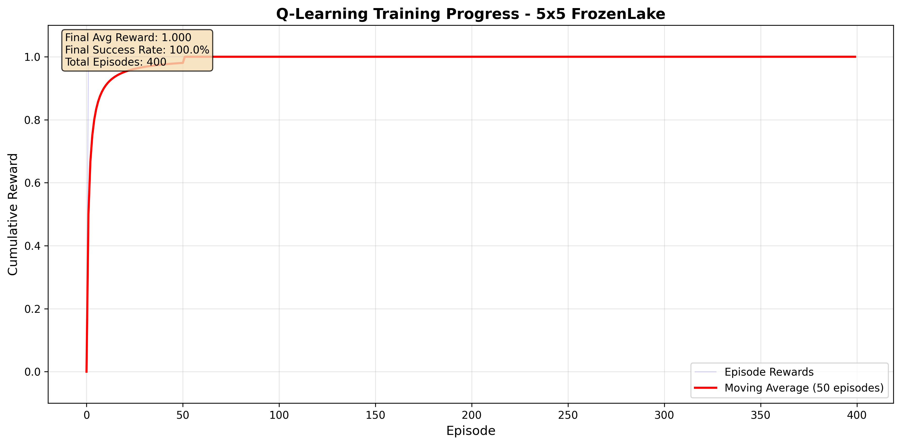
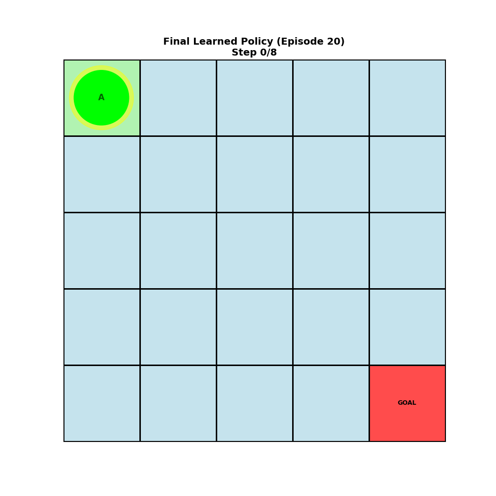
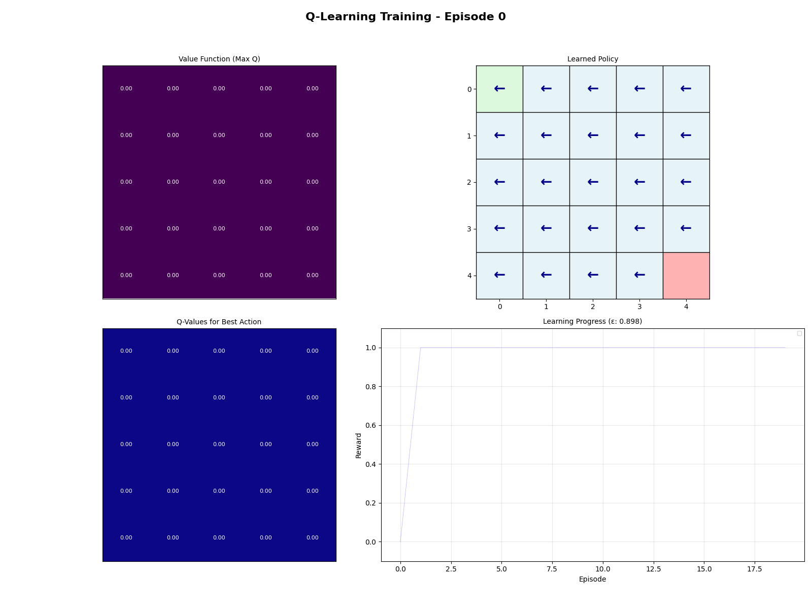
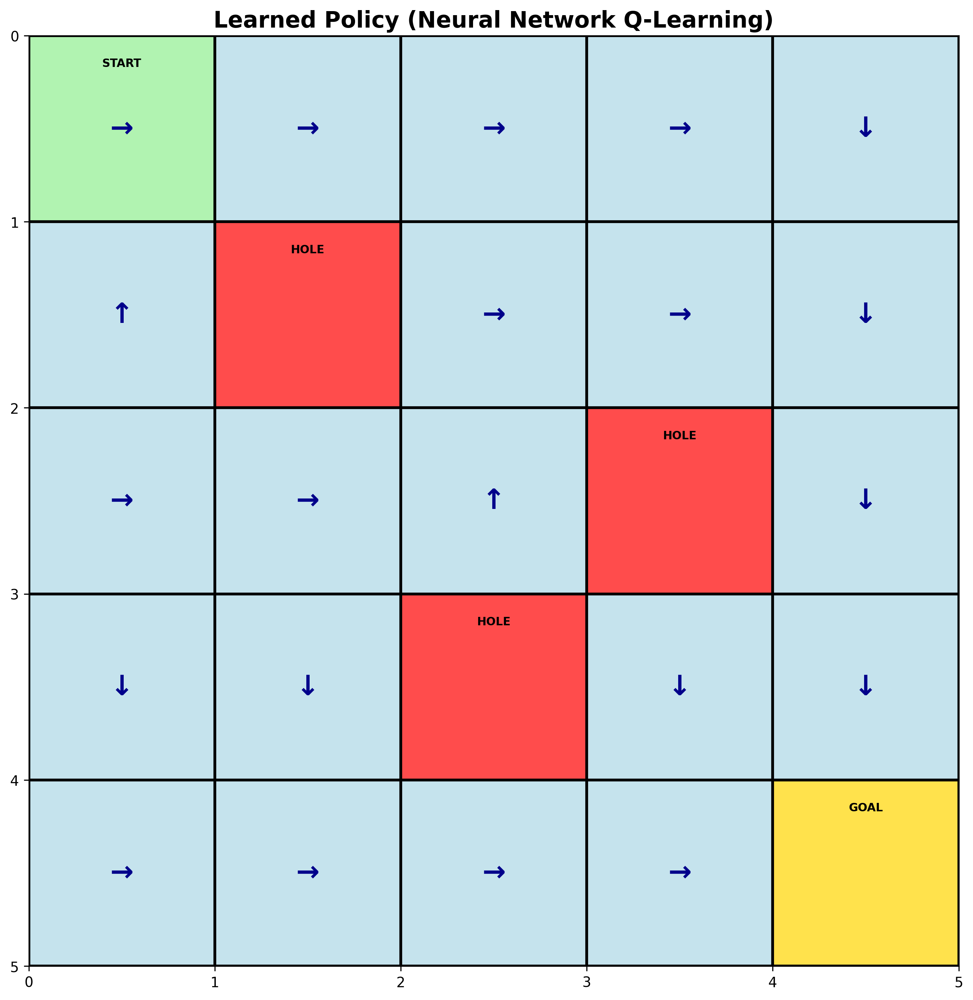
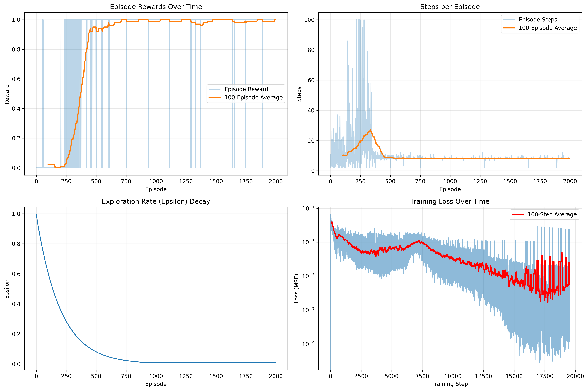

# GridWorld - Reinforcement Learning Environment

A comprehensive reinforcement learning project implementing various RL algorithms on a customizable GridWorld environment. This project features multiple agents including Q-Learning, Deep Q-Learning, Policy Iteration, and Value Iteration algorithms.

## 🚀 Setup Instructions

### Prerequisites
- Python 3.8 or higher
- pip (Python package installer)

### Environment Setup

1. **Clone the repository** (if you haven't already):
```bash
git clone https://github.com/Amine-Amllal/GridWord.git
cd GridWord
```

2. **Create a virtual environment**:

**On Windows (PowerShell):**
```powershell
python -m venv RL
.\RL\Scripts\Activate.ps1
```

**On Windows (Command Prompt):**
```cmd
python -m venv RL
RL\Scripts\activate.bat
```

**On macOS/Linux:**
```bash
python3 -m venv RL
source RL/bin/activate
```

3. **Install required packages**:
```bash
pip install -r requirements.txt
```

4. **Verify installation**:
```bash
python -c "import numpy, matplotlib, imageio; print('All dependencies installed successfully!')"
```

### Running the Agents

Once the environment is set up, you can run any of the agents:

```bash
# Q-Learning Agent
python q_learning_agent.py

# Dynamic Q-Learning Agent (with moving obstacles)
python q_learning_agent_dynamic.py

# Deep Q-Learning Agent (Neural Network)
python neural_network_q_value_agent.py

# Policy Iteration Agent
python policy_iteration_agent.py

# Value Iteration Agent
python value_iteration_agent.py

# Random Agent (baseline)
python random_agent.py
```

## 🎮 Environment Features

The GridWorld environment (`frozenlake_env.py`) provides a highly **customizable** frozen lake simulation where:

### Customizable Parameters

- **Grid Size**: Users can define custom grid dimensions (rows × columns)
- **Start Position**: Configurable starting position for the agent
- **Goal Position**: Users can place the goal anywhere on the grid
- **Obstacles (Holes)**: Fully customizable obstacle positions
- **Dynamic Elements**: Support for moving goals and obstacles (in dynamic agent mode)

### Example Customization

```python
from frozenlake_env import make_frozen_lake

# Create a custom 8x8 environment
env = make_frozen_lake(
    nrow=8,
    ncol=8,
    start_state=(0, 0),
    goal=(7, 7),
    holes=[(2, 2), (3, 5), (5, 3), (6, 6)]
)
```

### Environment Elements

- **S** (Start): The agent's starting position
- **F** (Frozen): Safe cells where the agent can walk
- **H** (Hole): Obstacles that terminate the episode with negative reward
- **G** (Goal): Target destination with positive reward

The agent can perform 4 actions: **LEFT**, **DOWN**, **RIGHT**, **UP**

## 🤖 Q-Learning Agent

The Q-Learning agent implements the classic tabular Q-Learning algorithm, learning optimal policies through trial and error. This agent maintains a Q-table that stores action values for each state-action pair.

### Key Features:
- Epsilon-greedy exploration strategy
- Adaptive learning with decay
- Visualization of learned policy
- Path animation showing agent navigation

### Training Results

**Cumulative Rewards During Training:**


This graph shows how the agent's performance improves over episodes, with cumulative rewards increasing as the agent learns better policies.

**Final Learned Path:**


The agent successfully navigates from the start position to the goal while avoiding obstacles, following the optimal policy learned through Q-Learning.

**Training Animation:**


This animation visualizes the learning process, showing how the agent explores the environment and gradually improves its path-finding strategy.

### Performance Metrics:
- Learns optimal policy within hundreds of episodes
- Achieves high success rate in reaching the goal
- Adapts to different environment configurations

## 🧠 Deep Q-Learning Agent (Neural Network)

The Deep Q-Learning agent uses a neural network to approximate Q-values, enabling it to generalize across states and handle more complex environments. This implementation uses a custom feedforward neural network built with NumPy.

### Key Features:
- Multi-layer neural network architecture
- Experience-based learning
- State encoding for neural input
- Gradient descent optimization
- Policy visualization with heatmaps

### Architecture:
- Input Layer: State encoding (position + grid features)
- Hidden Layers: Configurable depth and width
- Output Layer: Q-values for each action
- Activation: ReLU for hidden layers

### Training Results

**Learned Policy Visualization:**


This heatmap shows the learned policy across the grid, with arrows indicating the optimal action for each state. The color intensity represents the maximum Q-value at each position.

**Training Progress:**


The training progress charts display:
- Episode rewards over time
- Success rate improvement
- Loss convergence
- Average Q-values evolution

### Performance Metrics:
- Better generalization than tabular Q-Learning
- Smoother learning curves with experience replay
- Capable of handling larger state spaces
- More stable convergence with proper hyperparameter tuning

## 📊 Additional Agents

### Policy Iteration Agent
Implements dynamic programming to compute the optimal policy by iteratively improving the policy until convergence.

### Value Iteration Agent
Uses dynamic programming to compute optimal value function and derives the optimal policy from it.

### Random Agent
Baseline agent that takes random actions, useful for comparison with learning agents.

## 📁 Project Structure

```
GridWord/
├── frozenlake_env.py              # Customizable environment
├── q_learning_agent.py            # Tabular Q-Learning
├── q_learning_agent_dynamic.py    # Q-Learning with dynamic obstacles
├── neural_network_q_value_agent.py # Deep Q-Learning
├── policy_iteration_agent.py      # Policy Iteration algorithm
├── value_iteration_agent.py       # Value Iteration algorithm
├── random_agent.py                # Random baseline agent
├── requirements.txt               # Python dependencies
├── README.md                      # This file
└── q_learning_results_*/          # Training results and visualizations
```

## 🎯 Results and Outputs

Each agent automatically saves results to timestamped folders containing:
- Training animations (GIF)
- Policy visualizations (PNG)
- Performance metrics (PNG/TXT)
- Q-tables or network parameters (CSV/NPY)

## 📝 License

See the [LICENSE](LICENSE) file for details.

## 🤝 Contributing

Contributions are welcome! Feel free to:
- Add new RL algorithms
- Improve environment features
- Enhance visualizations
- Optimize training performance

## 📧 Contact

For questions or suggestions, please open an issue on GitHub.

---

**Happy Learning! 🚀**